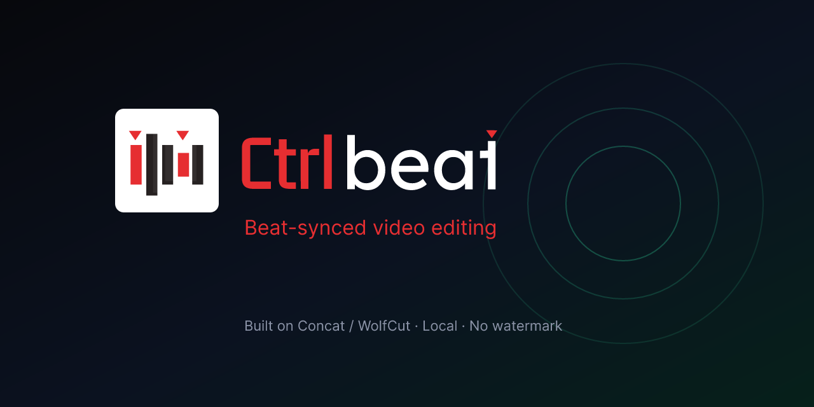

<div align="center">


# CtrlBeat

**Beat-synced video editing.** Local. No watermark. No account.

<p align="center">
  
  
  
</p>



</div>

---

CtrlBeat is a desktop video editor built for **music-driven cuts**: detect beats,
place images and videos on the grid, add visualizer / ASCII overlays, bake them
into the timeline, and export locally.

It is a **named product fork** of [Concat / WolfCut](https://github.com/jub0t/Concat).
It is **not** an official Concat release. See [ATTRIBUTION.md](ATTRIBUTION.md).

## Highlights

**CtrlBeat layer**

- Beat detection with timeline marks (Balanced / Bass / Piano / Dense)
- Place images **and** videos on beats (loop, beats-per-clip, gap-only duration)
- Music visualizer presets (particles, radial, kaleidoscope, Lissajous, orbit)
- ASCII / code-symbol overlays (13 glyph sets) with live preview
- Bake overlays to a top track so export includes them
- Freeze frame, duplicate clips, fit/match sizing, video source-start window
- Beats tools live in the **Beats** panel (not dumped in File)

**From the Concat engine**

- Multi-track timeline, effects, filters, titles, templates
- On-device captions and TTS hooks
- Local FFmpeg export, no cloud required for core editing

## Install (Windows)

Share / run the NSIS installer (built locally; not always on GitHub Releases):

```text
releases/CtrlBeat_0.3.1_x64-setup.exe
```

1. Double-click the setup.exe  
2. If SmartScreen appears: **More info** → **Run anyway** (unsigned build)  
3. Open **CtrlBeat** from the Start menu  

Projects default to `Desktop/CtrlBeat`.

## Docs in this repo

| Doc | What it is |
|-----|------------|
| [CTRLBEAT.md](CTRLBEAT.md) | Product identity and quick start |
| [ATTRIBUTION.md](ATTRIBUTION.md) | Concat / WolfCut credit and license notes |
| [FORK_NOTES.md](FORK_NOTES.md) | Engineering changelog for this fork |
| [brandkit/](brandkit/) | Logo masters, icons, GitHub / OG assets |
| [PR_DRAFTS.md](PR_DRAFTS.md) | Draft upstream PRs (freeze / duplicate / fit) |

## Develop

Prerequisites: Node.js, Rust, Visual Studio 2022 Build Tools + Windows SDK.

```text
cd desktop
npm install
npm run app
```

Release installer (from a VS Developer / `vcvars64` shell):

```text
cd desktop
npx tauri build
```

Run scripts from `desktop/` (repo root has no `app` script).

## Brand

Source of truth: `brandkit/master/*.svg`. Regenerate sized assets:

```text
cd brandkit/tools
npm install
npm run render
```

Then refresh Tauri icons from `brandkit/app/icon-512.png` (see `brandkit/README.md`).

## Mobile

CtrlBeat is **Windows desktop** today. For phones, use CapCut, kneecap, or LibreCuts.

## License

Covered sources in this tree: see [LICENSE](LICENSE) (MPL-2.0 as shipped here)
and [THIRD_PARTY_NOTICES.md](THIRD_PARTY_NOTICES.md). Upstream Concat may use
additional terms on their own releases. Keep Concat / WolfCut credit when you
redistribute.
